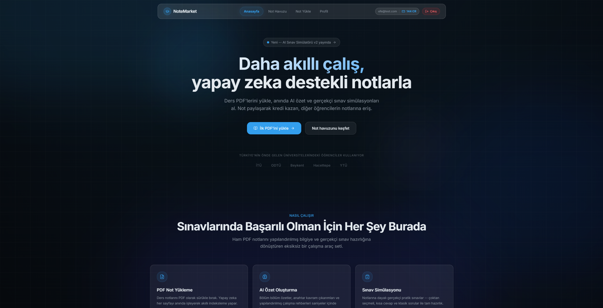
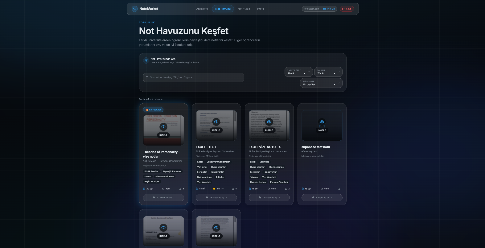
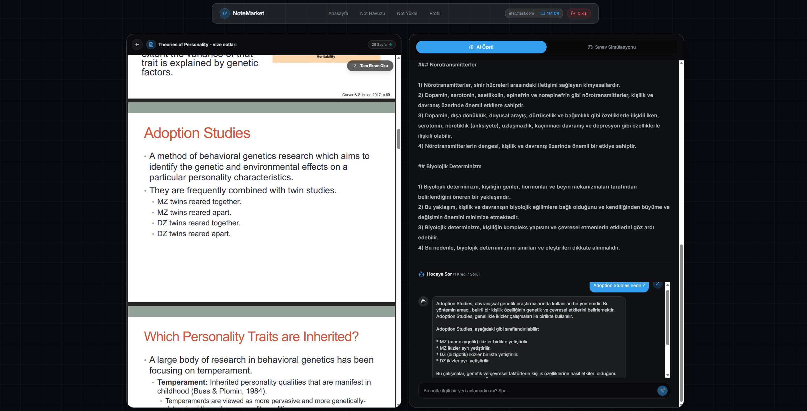
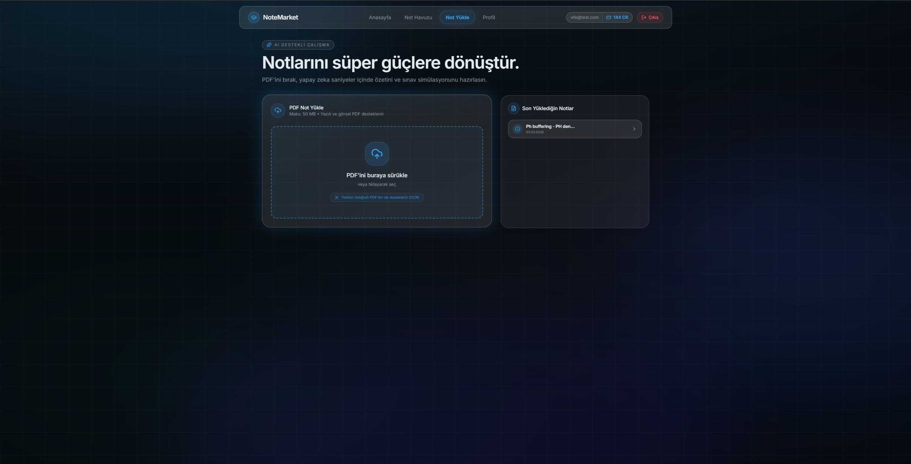
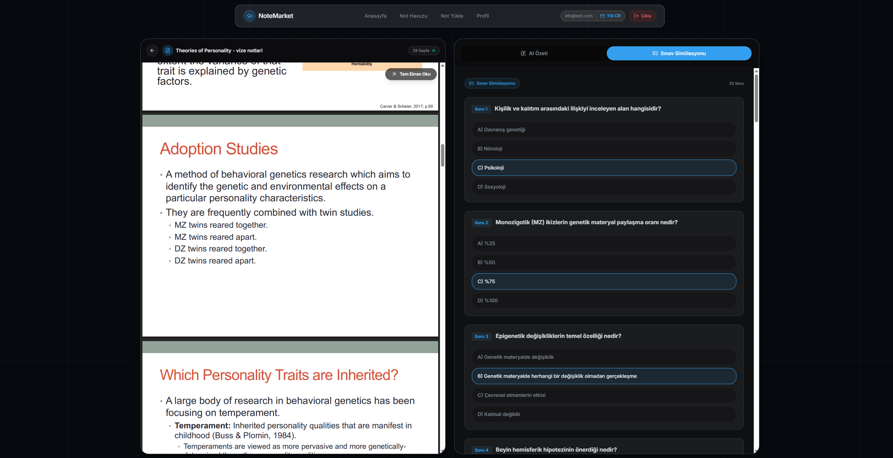

# 🚀 NoteMarket – AI-Powered Educational Marketplace

> 🚀 Live AI-powered platform transforming how students learn, interact with, and monetize academic knowledge
> 🚀 Built and deployed as a real-world AI product with end-to-end functionality

NoteMarket is a full-stack AI-powered educational marketplace that enables students to share, monetize, and interact with academic content.
It combines a scalable marketplace with intelligent learning tools powered by LLMs.

---


---

## ✨ Features

* 📚 **Note Sharing & Monetization**
  Upload, discover, and monetize academic notes through a credit-based marketplace

* 🤖 **AI-Powered Learning (LLM-based)**
  Generate summaries, quizzes, and ask real-time questions on any uploaded content

* 🧠 **Exam Simulation**
  Simulate exams with AI-generated questions tailored to your study materials

* 📸 **OCR Integration**
  Convert handwritten and PDF notes into structured, searchable data

* 💰 **Credit-Based Economy**
  Gamified system with incentive design and inflation-control mechanisms

---

## ⚡ How It Works

1. Users upload handwritten or digital notes
2. OCR extracts and structures the content
3. AI generates summaries, quizzes, and Q&A
4. Users interact through an intelligent learning interface
5. Content creators earn credits via the marketplace

---

## 🛠️ Tech Stack

* **Frontend:** Next.js, Tailwind CSS
* **Backend & Database:** Supabase (PostgreSQL)
* **AI Integration:** Groq API (LLM-based processing)
* **OCR:** Tesseract / API-based solution

---

## 📸 Screenshots

### 🏠 Home



### 📚 Marketplace



### 🤖 AI Interaction



### 📤 Upload System



---

## 🎯 Additional Features

### 🧪 Exam Simulation



---

## 🌐 Live Demo

👉 https://notemarket-tr.vercel.app/

---

## 💻 Repository

👉 https://github.com/efemalis/notemarket

---

## ⚙️ Getting Started

```bash
git clone https://github.com/efemalis/notemarket.git
cd notemarket
npm install
npm run dev
```

---

## 🔑 Environment Variables

Create a `.env.local` file:

```env
NEXT_PUBLIC_SUPABASE_URL=your_supabase_url
NEXT_PUBLIC_SUPABASE_ANON_KEY=your_supabase_anon_key
GROQ_API_KEY=your_groq_api_key
```

---

## 🧠 Architecture Overview

* **Next.js** → UI & user interaction
* **Supabase** → Authentication, database, storage
* **Groq API** → AI processing (Q&A, summaries, quizzes)
* **OCR Pipeline** → Converts notes into structured data

---

## 📌 Future Improvements

* 📈 Recommendation system
* 📱 Mobile optimization
* 🧠 Better AI accuracy
* 🌍 Multi-language support

---

## 🎯 Vision

To build a global AI-powered learning ecosystem where students don’t just consume content,
but actively interact, learn, and earn.

---

## 📫 Contact

* LinkedIn: https://www.linkedin.com/in/ali-efe-mal%C4%B1%C5%9F-5354a3293/

---

## 👤 Author

Developed by **Ali Efe MALIŞ**

---

⭐ If you like this project, consider giving it a star!
